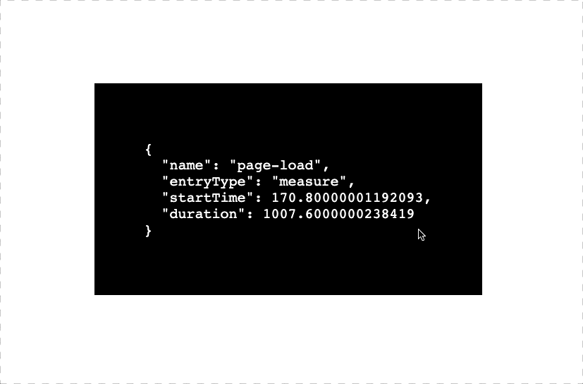

# performance-ruler

Measure page loading speed using `performance.mark` and `performance.measure`.

👇🏼 Custom hook defined to dynamically 🪝 markers and measure func

```typescript
function usePerformanceRuler(name: string) {
  const start = `${name}-start`
  const end = `${name}-end`

  return {
    startMarker: () => performance.mark(start),
    endMarker: () => performance.mark(end),
    measure: () => {
      /* fire analytics here if desired */
      performance.measure(name, start, end)
    },
  }
}
```

👇🏼 Consume usePerformanceRuler like this

```typescript
function App() {
  const { startMarker } = usePerformanceRuler('page-load')

  function navigate() {
    startMarker()
  }

  return <button onClick={navigate} />
}

function Page() {
  const { endMarker, measure } = usePerformanceRuler('page-load')

  endMarker()
  measure()

  return <div>hello world</div>
}
```

👇🏼 this is the metric measured by the performance API

```json
{
  "name": "page-load",
  "entryType": "measure",
  "startTime": 171.69999998807907,
  "duration": 1006.6999999880791
}
```


